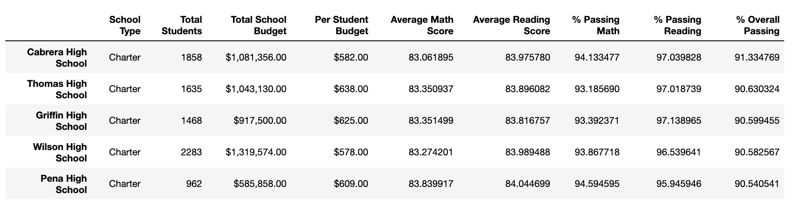
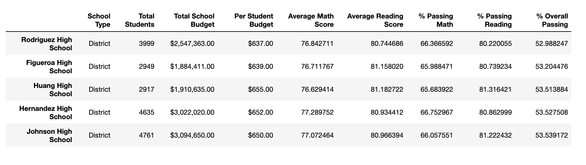
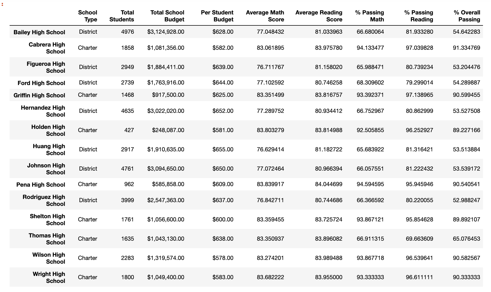
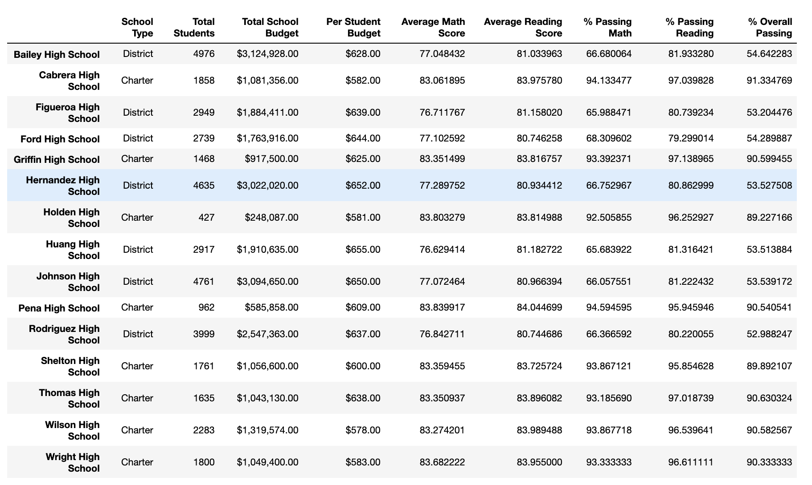

# School_District_Analysis

## Overview  

The purpose of this school district analysis is to help the school board analyze data about students math and reading scores from different high schools to determine their average scores, percent of students who passed math, percent of students who passed reading, and percent overall passing per school. We were also able to determine scores by school size, scores by school type, and scores by school spending to be able to pinpoint how the school district can help students increase their academic performance in school.

## Results 
•	 The district summary shows that the all of the top 5 performing schools with the highest overall passing rates are charter schools while the lowest performing schools with the lowest overall passing rates are district schools. 

•	The school summary shows that the schools with the smaller spending ranges per student is correlated with higher overall passing rates, which surprised me. I also found out that smaller school sizes in general had students with higher overall passing rates. 

•	Once I replaced the ninth graders math and reading scores, the numbers showed that the percent of students passing math, the percent of students passing reading, and percent of overall passing is much higher than when including the ninth graders math and reading scores. The new data without the ninth graders performance also shows that Thomas High School has higher passing rates relative to other schools. 

•	Replacing ninth graders scores has a positive effect on math and reading scores by grade. The percent passing math and percent passing reading has all increased. Replacing ninth-grade scores in Thomas High School however had no effect on scores by school spending, scores by school size, and scores by school type. 

## Images
Data on Top 5 Performing Schools: 

Data on Bottom 5 Performing Schools:

School District Data For Each School:

School District Data For Each School Wihtout Thomas High School Math/Reading Scores: 

## Summary 
I think that four major changes that occurred is that when reading and math scores for 9th graders at Thomas High School is that the overall passing rate for students at Thomas High School increased, as well as percentage of 10th to 12th graders that passed math and reading has increased significantly. For example, when we include 9th graders reading and math scores the passing math and reading percentage are 66.9 % and 69.7%. When we look at percent passing math and reading percentage from only 10th to 12th graders in Thomas High School however, we saw that the percentages increased to  93.2% and 97.0%. 
In addition, students average math and reading scores have increased as well when we disregard Thomas High School’s math and reading scores.  
